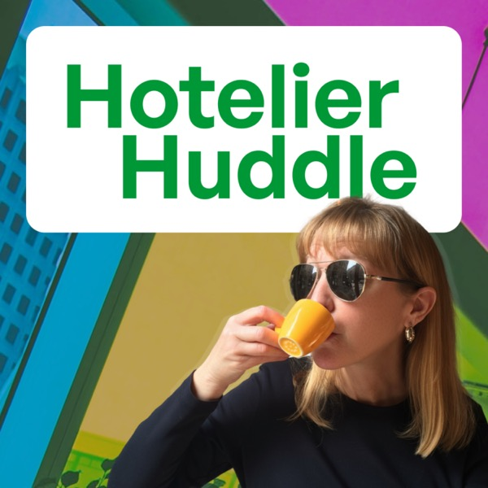

# The Hotelier Huddle: open source knowledge base

[](https://creativecommons.org/licenses/by/4.0/)
[](https://opensource.org/licenses/MIT)
[](#episode-catalog-and-holdings)
[](#corpus-metrics-and-verbatim-verification)
[-gold.svg)](#seven-thematic-virtual-panels)

> An archive of *The Hotelier Huddle* podcast transcripts, virtual panel syntheses and hospitality terminology registers, formatted with YAML frontmatter for ingestion by Claude Code, Cursor and Model Context Protocol (MCP) clients.

* **Host and creator:** Shannon Knapp, CHIA (Founder and Principal, SKnapp Consulting)  
* **Audio editor and producer:** Heidi Egger  
* **Curator and knowledge engine architect:** Dr David Haberlah  
* **Published RSS feed:** [anchor.fm/s/109667b00/podcast/rss](https://anchor.fm/s/109667b00/podcast/rss)  
* **Apple Podcasts:** [id1840076396](https://podcasts.apple.com/us/podcast/hotelier-huddle/id1840076396)  
* **Spotify for Podcasters:** [podcasters.spotify.com/pod/show/hotelier-huddle](https://podcasters.spotify.com/pod/show/hotelier-huddle)  

---

## Homage to the legacy of Shannon Knapp

This repository is an homage to the legacy of Shannon Knapp, CHIA. Until her last breath, Shannon was passionate about advancing the hotel profession alongside her best friends in the industry, the colleagues and leaders she interviewed across these 20 episodes.

Following her passing, her friends and collaborators brought this archive together so her work would endure: Heidi Egger engineered the audio and produced the recordings, and David Haberlah transcribed the corpus, built the open-source repository and hosts the Model Context Protocol server.

This archive preserves Shannon's contribution so her legacy continues to support future generations of hoteliers.

---

## Quick start for AI tools and MCP

### 1. Ingesting into Claude Code or Cursor

Clone or point your AI assistant directly at this directory:

```bash
git clone __PROTECTED_TOKEN_10__
```

All transcripts in `transcripts/` feature standardised YAML frontmatter, strict monotonic timestamps and verified speaker diarisation. You can ask:

* *"According to Tamie Matthews and Matt Camp, why does rate day-trading reduce hotel profitability?"*
* *"What are David Haberlah's frameworks for enterprise data boundaries and AI operating systems in hotels?"*
* *"Synthesise Greg Brady's 8 leadership lessons for a newly promoted General Manager."*

### 2. Model Context Protocol server

Run the bundled MCP server locally with zero installation using `uvx`:

```bash
uvx --from ./mcp_server hotelier-huddle-mcp
```

Or add to your `claude_desktop_config.json`:

```json
{
  "mcpServers": {
    "hotelier-huddle": {
      "command": "python3",
      "args": ["/path/to/hotelier-huddle/mcp_server/server.py"]
    }
  }
}
```

---

## Repository layout

```text
hotelier-huddle/
├── README.md                      # Project overview, quick start and architecture
├── LICENSE.md                     # Open source license (Code: MIT; Content: CC BY 4.0)
├── CONTRIBUTING.md                # Contribution guidelines and transcript standardisation rules
├── .gitignore                     # Git rules (audio binaries excluded from repo)
├── index.json                     # Lightweight master index for instant MCP / RAG consumption
├── HOTELIER_HUDDLE_METADATA.json  # Canonical provenance and metadata register
├── HOSPITALITY_TERMINOLOGY_STANDARDISATION_REGISTER.md  # Standardised industry glossary
├── HOTELIER_HUDDLE_EXPERT_PANEL_MATRIX.md               # 7 Thematic virtual panels matrix
├── PUBLICATION_READINESS_RECONCILIATION.md              # Master verification and audit report
│
├── transcripts/                   # 20 Verbatim transcripts with YAML frontmatter
│   ├── 01-Will Sales and Revenue Ever See Eye To Eye-Francis Purvey.md
│   └── ...
│
├── derived_knowledge_base/        # Multi-dimensional thematic synthesis
│   ├── virtual_panels/            # 7 Cross-episode virtual roundtable panels
│   └── question_knowledge_bases/  # 5 Signature question anthologies
│
├── mcp_server/                    # FastMCP server implementation
│   ├── server.py                  # Server exposing tools, resources and prompts
│   └── pyproject.toml             # uv/pip package configuration
│
└── scripts/
    └── download_audio.py          # Script to stream/download raw audio from CDN
```

---

## Episode catalog and holdings

| Ep # | Title | Date | Duration | Words | Guest and Organisation | Controlled tags |
| :---: | :--- | :---: | :---: | :---: | :--- | :--- |
| **01** | Will Sales and Revenue Ever See Eye To Eye? | 2025-08-28 | 32:41 | 5,348 | **Francis Purvey** (*Pennine Hospitality*) | `sales-vs-revenue`, `trevpar`, `distribution` |
| **02** | The Modern Hotelier: Lessons from the Frontlines | 2025-09-04 | 26:34 | 4,528 | **Alexia Kalis** (*The Royce*) | `front-office`, `guest-loyalty`, `luxury-service` |
| **03** | Are Full Hotels Always the Most Profitable? | 2025-09-12 | 34:04 | 5,649 | **Tamie Matthews** (*RevenYou*) | `net-revpar`, `goppar`, `distribution-costs` |
| **04** | The Accidental Hotelier: Sales, Solo Ventures & Staying Power | 2025-10-09 | 40:22 | 7,654 | **Tracy Martin** (*The Wisdom Well*) | `consulting`, `mentorship`, `corporate-sales` |
| **05** | The AI Operating System is Coming | 2025-10-18 | 54:45 | 10,300 | **Dr David Haberlah** (*Bella Sláinte*) | `ai-os`, `data-boundaries`, `agentic-workflows` |
| **06** | 8 Leadership Lessons from Award Winning Hotel GM | 2025-10-23 | 24:26 | 4,256 | **Greg Brady** (*Sofitel Sydney*) | `general-management`, `culture`, `calm-leadership` |
| **07** | Are You Revenue Managing or Day Trading? | 2025-10-31 | 38:09 | 5,798 | **Matt Camp** (*Revenue Consultant*) | `revenue-management`, `anecdata`, `rate-stability` |
| **08** | Crafting a Distinct Brand: Lessons from an Expert | 2025-11-07 | 40:29 | 7,295 | **Eve Weatherburn** (*Brand Journey Partner*) | `hotel-branding`, `luxury-positioning`, `resilience` |
| **09** | 5-Star Guest Relations Agent on Profit & Purpose | 2025-11-14 | 38:46 | 6,223 | **Joaquin D'Orazio** (*The Boca Raton*) | `guest-relations`, `hyper-personalisation`, `service` |
| **10** | Precincts, Wellness & What Every Hotelier Should Know | 2025-11-18 | 45:45 | 7,560 | **Andrew Taylor** (*Cre8tive Hotels*) | `development`, `precincts`, `wellness-revenue` |
| **11** | Rising Through Reservations: Business Mindset & AI | 2025-12-04 | 28:18 | 4,593 | **Jasmine Xie** (*PARKROYAL Parramatta*) | `reservations`, `waitlists`, `distribution` |
| **12** | Night Audit to CEO: Saying Yes Changes Everything | 2025-12-12 | 47:12 | 8,550 | **Michael Johnson** (*Accommodation Australia*) | `night-audit-to-ceo`, `boardroom-skills`, `relove` |
| **13** | Hotel Sales Consultant: The Magic is in You | 2025-12-21 | 31:15 | 5,179 | **Kelley Wacher** (*Corporate Magic™*) | `sales-consulting`, `executive-coaching`, `mindset` |
| **14** | Hotel Owner Insights: 23 Years Of Building Balance | 2026-01-07 | 25:51 | 4,588 | **Jean-Christophe Buillet** (*A Sunset Chateau*) | `owner-operator`, `boutique-luxury`, `sedona` |
| **15** | How I Grew 48 Hotels Worth $1.8 Billion | 2026-01-21 | 36:19 | 7,110 | **Andrew Turner** (*Minor Hotels*) | `development`, `strata-title`, `scaling` |
| **16** | You're a Rock Star (Someone Had to Tell You) | 2026-02-19 | 32:45 | 5,119 | **Janet McBain** (*Facilities Management*) | `facilities`, `transferable-skills`, `boardroom` |
| **17** | What Rental Cars Taught Me About Selling Rooms | 2026-02-27 | 33:36 | 5,482 | **Mike Godfrey** (*Commercial Strategist*) | `revenue-management`, `car-rental`, `mlos`, `pacing` |
| **18** | Two Habits That Will Change How You Lead | 2026-04-19 | 32:47 | 5,495 | **Heidi Gempel** (*HGE International*) | `leadership-habits`, `emotional-intelligence` |
| **19** | How to Navigate Career Changes | 2026-06-21 | 42:51 | 7,682 | **Stephen Fraser** (*EVT Connect Hospitality*) | `career-pivots`, `contact-centres`, `modernisation` |
| **20** | Hotel Sales Skills that Fill Planes | 2026-07-11 | 45:25 | 8,577 | **Matthew Borger** (*Newcastle Airport / DPS*) | `hotel-sales`, `aviation`, `destination-marketing` |

---

## Seven thematic virtual panels

The derived knowledge base synthesises verbatim dialogue across related episodes into thematic roundtable councils:

1. [Panel 01: Commercial and revenue management mastermind](derived_knowledge_base/virtual_panels/PANEL_01_Commercial_Alignment_Sales_vs_Revenue.md) (Purvey, Matthews, Camp, Godfrey, Borger)
2. [Panel 02: AI operating system and intelligent hotel tech](derived_knowledge_base/virtual_panels/PANEL_02_AI_Technology_and_the_Human_Touch.md) (Haberlah, Xie, Taylor, Buillet, Gempel, Purvey)
3. [Panel 03: Crisis management and brand resilience](derived_knowledge_base/virtual_panels/PANEL_03_Crisis_Management_Brand_Recovery_and_Resilience.md) (Purvey, Kalis, Weatherburn, Johnson, Buillet)
4. [Panel 04: Modern hotelier leadership and culture](derived_knowledge_base/virtual_panels/PANEL_04_Leadership_Culture_and_People_Over_Profit.md) (Brady, Kalis, Johnson, Wacher, Turner, Gempel)
5. [Panel 05: Non-linear careers and boardroom capabilities](derived_knowledge_base/virtual_panels/PANEL_05_Non_Linear_Careers_and_Boardroom_Skills.md) (D'Orazio, Johnson, Wacher, McBain, Fraser)
6. [Panel 06: Hotel development, precincts and asset strategy](derived_knowledge_base/virtual_panels/PANEL_06_Hotel_Development_Precincts_and_Asset_Strategy.md) (Weatherburn, Taylor, Buillet, Turner)
7. [Panel 07: Frontline guest experience and service craft](derived_knowledge_base/virtual_panels/PANEL_07_Frontline_Guest_Experience_and_Service_Craft.md) (Kalis, Martin, Brady, D'Orazio, Xie)

---

## Corpus metrics and verbatim verification

* **Total audio runtime:** 12 hours, 37 minutes, 21 seconds (45,441 seconds)
* **Total words transcribed:** 131,238 words
* **Total speaker turns:** 2,406 turns
* **Verbatim quote verification:** 340 of 340 (100.0%) quoted turns in `derived_knowledge_base/` match source transcripts character-for-character.
* **Timestamp monotonicity:** 100% strictly monotonic (0 regressions across 2,400+ turns).
